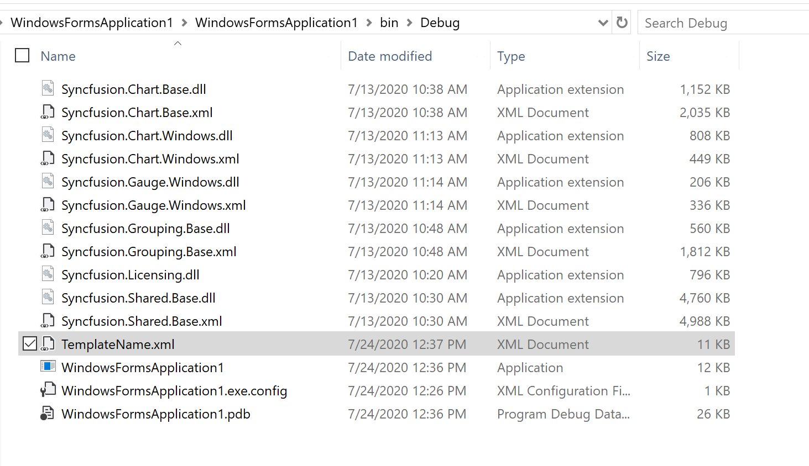

# How to disable the chart template saving alert window in WinForms Chart

This article explains how to avoid the following pop-up window while showing up for [saving the chart template](https://help.syncfusion.com/windowsforms/chart/design-time-features#save-template) at load time.


If your requirement is to save the chart template (series properties and the point properties, which was saved in XML file) without getting that pop-up then, please refer the following code sample instead of saving like [this](https://help.syncfusion.com/windowsforms/chart/design-time-features#saving-chart-series-data). 
C#
```
..
var template = new ChartTemplate(typeof(ChartControl));
template.Scan(this.chartControl1);
template.Save("TemplateName.xml");
..
```

Chart Template saving location is bin->debug->FileName.xml




## See Also

[How to bind the data source via chart wizard](https://www.syncfusion.com/kb/7680/how-to-bind-the-data-source-via-chart-wizard)

[How to create a real-time chart](https://www.syncfusion.com/kb/9344/how-to-create-a-real-time-chart)

[How do I print a Chart](https://www.syncfusion.com/kb/4108/how-do-i-print-a-chart)

[How to create Chart in VB .NET Windows Forms](https://www.syncfusion.com/kb/10806/how-to-create-chart-in-vb-net-windows-forms)

