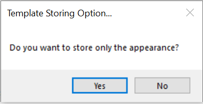

# How to disable the chart template saving alert window in WinForms Chart

This article explains how to avoid below popup window while showing up for saving the chart template in load time.



The above alert window shows when you are executing Save command as like in below

```
ChartTemplate.Save(this.chartControl1, "TemplateName.xml");
```

The below code snippet is used to save the template (series and point properties as XAML file) by default without getting that popup 

C#
```
..
var template = new ChartTemplate(typeof(ChartControl));
template.Scan(this.chartControl1);
template.Save("TemplateName.xml");
..
```

Chart Template saving location is bin->debug->FileName.xml


## See Also

[How to bind the data source via chart wizard](https://www.syncfusion.com/kb/7680/how-to-bind-the-data-source-via-chart-wizard)

[How to create a real-time chart](https://www.syncfusion.com/kb/9344/how-to-create-a-real-time-chart)

[How do I print a Chart](https://www.syncfusion.com/kb/4108/how-do-i-print-a-chart)

[How to create Chart in VB .NET Windows Forms](https://www.syncfusion.com/kb/10806/how-to-create-chart-in-vb-net-windows-forms)

